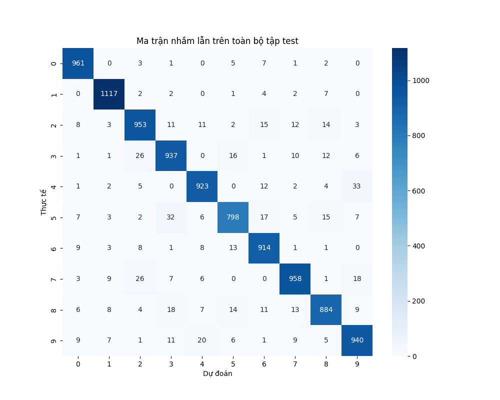
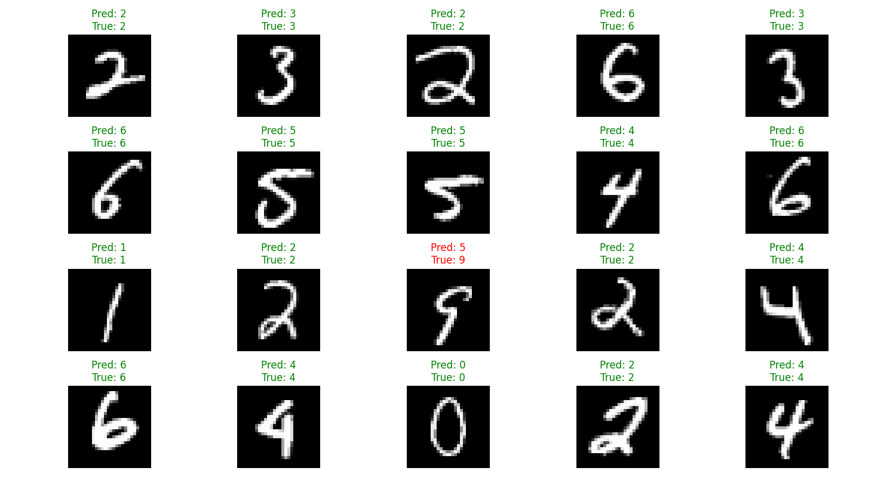
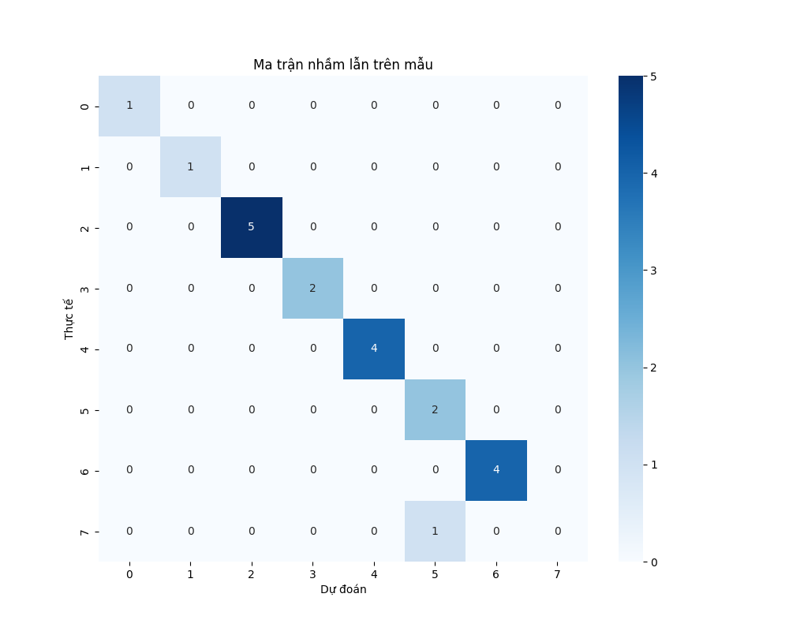

# Bài tập Nhận dạng chữ số viết tay MNIST - Week 1

## Giới thiệu

Bài tập này xây dựng một mạng neural đơn giản để nhận dạng chữ số viết tay từ bộ dữ liệu MNIST. Mô hình sử dụng kiến trúc neural network với một lớp ẩn và được huấn luyện bằng thuật toán gradient descent.

## Cấu trúc bài tập

```
.
├── dataset/               # Thư mục chứa dữ liệu MNIST
├── checkpoint/           # Thư mục lưu trữ các checkpoint của mô hình
├── model.py             # File định nghĩa kiến trúc mạng neural
├── data.py              # File xử lý dữ liệu
├── evaluate.py          # File đánh giá mô hình
├── results.csv          # Kết quả thử nghiệm các siêu tham số
├── report.md            # Báo cáo chi tiết về Bài tập
└── README.md            # File này
```

## Tính năng

-   Xây dựng mạng neural với một lớp ẩn
-   Hỗ trợ nhiều hàm kích hoạt: ReLU, Sigmoid, Tanh
-   Huấn luyện mô hình với mini-batch gradient descent
-   Lưu và tải checkpoint của mô hình
-   Thử nghiệm với nhiều bộ siêu tham số khác nhau
-   Đánh giá mô hình bằng độ chính xác và ma trận nhầm lẫn
-   Trực quan hóa kết quả dự đoán

## Cài đặt

1. Clone repository này
2. Cài đặt các thư viện cần thiết:

```bash
pip install numpy pandas matplotlib torchvision scikit-learn seaborn
```

## Sử dụng

1. Huấn luyện mô hình:

```python
python model.py
```

2. Đánh giá mô hình:

```python
python evaluate.py
```

## Kết quả

-   Mô hình được huấn luyện với nhiều bộ siêu tham số khác nhau
-   Kết quả được lưu trong file `results.csv`
-   Các biểu đồ đánh giá:

    -   `evaluation_samples.png`: Kết quả dự đoán trên 20 mẫu ngẫu nhiên

    -   `confusion_matrix_samples.png`: Ma trận nhầm lẫn trên mẫu
    -   `confusion_matrix_full.png`: Ma trận nhầm lẫn trên toàn bộ tập test

## Kiến trúc mô hình

-   Input layer: 784 neurons (28x28 pixels)
-   Hidden layer: Số lượng neurons tùy chỉnh (16-128)
-   Output layer: 10 neurons (0-9)
-   Hàm kích hoạt: ReLU/Sigmoid/Tanh cho hidden layer, Softmax cho output layer

## Siêu tham số

-   Batch size: 16-128
-   Learning rate: 0.001-0.1
-   Hidden size: 16-128
-   Activation: ReLU/Sigmoid/Tanh
-   epochs: 10

## Tác giả

Đỗ Hoàng Vũ

## Giấy phép

MIT License

# Week 1: Deep Learning Project

## Kết quả đánh giá mô hình

### 1. Ma trận nhầm lẫn (Confusion Matrix)

<p align="center">
  
</p>

### 2. Mẫu đánh giá

Dưới đây là một số mẫu được chọn ngẫu nhiên từ tập test:

<p align="center">
  
</p>

### 3. Ma trận nhầm lẫn cho mẫu

<p align="center">
  
</p>

## Chi tiết kết quả

Các kết quả chi tiết được lưu trong file `results.csv`. Để xem báo cáo đầy đủ, vui lòng tham khảo file `report.md`.
