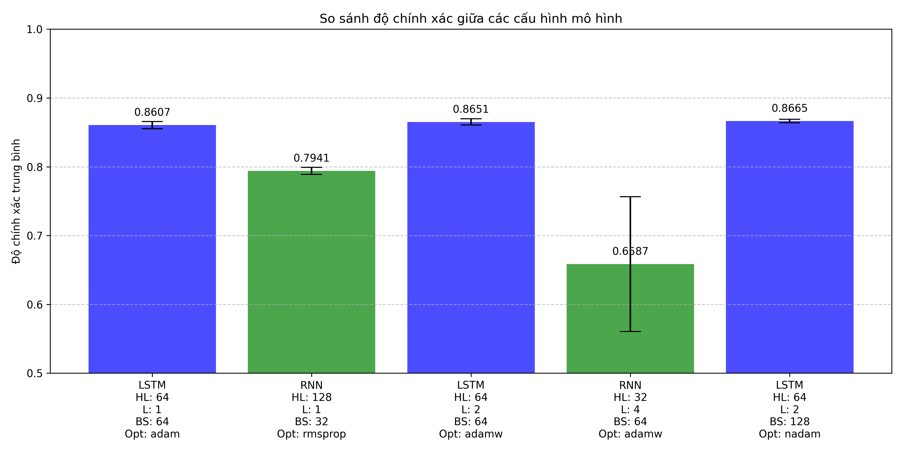
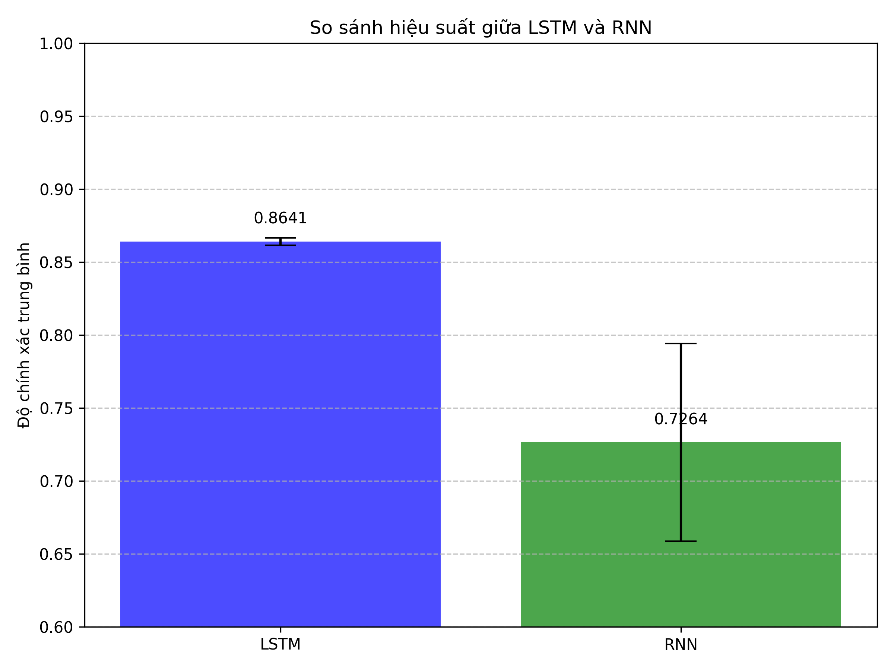
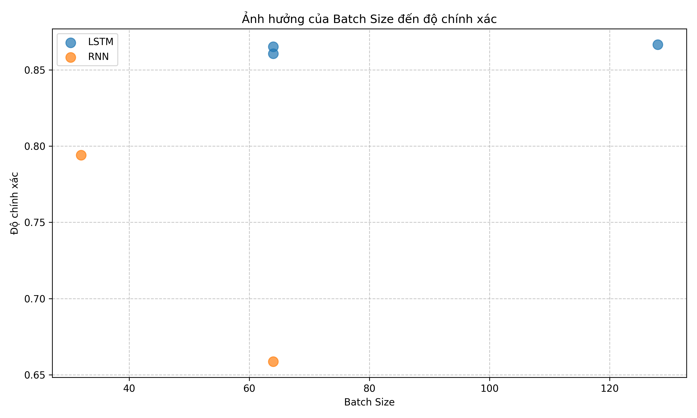
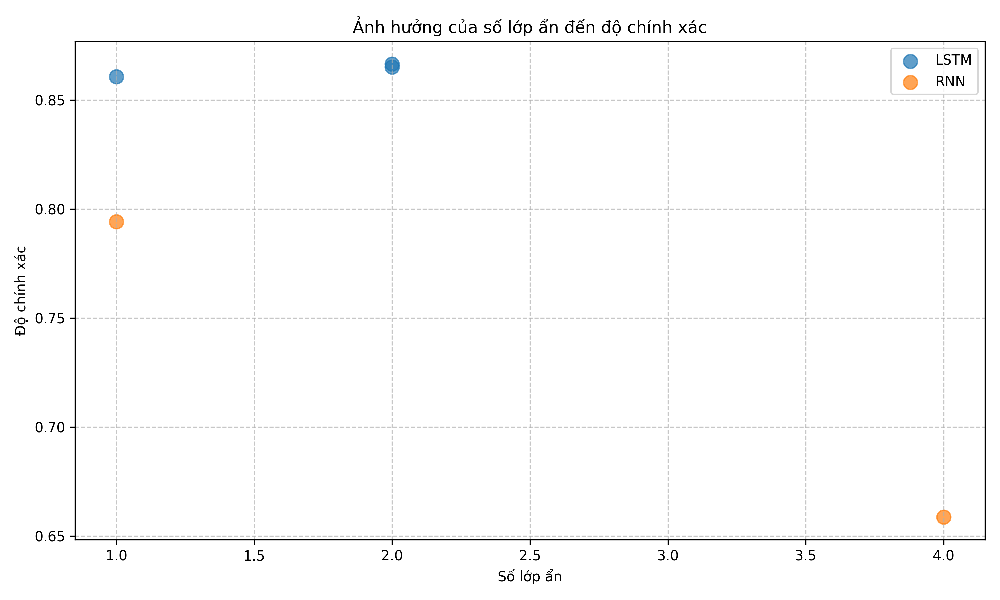
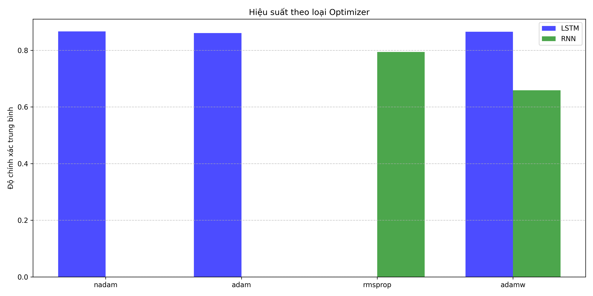

# Báo cáo kết quả dự án Phân loại Cảm xúc IMDb

## Đề bài

Xây dựng mô hình mạng học sâu (sử dụng thư viện PyTorch) để phân loại cảm xúc (tích cực hoặc tiêu cực) của các đoạn văn bản đánh giá phim. Sử dụng tập dữ liệu IMDb Movie Reviews bao gồm 25k đánh giá cho tập huấn luyện và 25k cho tập kiểm thử. Dự án sử dụng 5k mẫu cho mỗi tập huấn luyện và kiểm thử.

## Tiền xử lý dữ liệu

Dữ liệu gốc từ tập dữ liệu IMDb Movie Reviews được tiền xử lý thông qua các bước sau:

1. **Làm sạch văn bản**:

    - Chuyển đổi thành chữ thường
    - Loại bỏ ký tự đặc biệt và dấu câu
    - Loại bỏ HTML tags và URLs

2. **Tokenization**:

    - Sử dụng thư viện NLTK để tách văn bản thành các từ riêng biệt

3. **Xây dựng từ điển**:

    - Giới hạn kích thước từ điển là 15.000 từ thông dụng nhất
    - Thêm các token đặc biệt: `<pad>` (padding), `<unk>` (unknown)

4. **Chuyển đổi văn bản**:

    - Mã hóa các từ thành chỉ số (indices) dựa trên từ điển
    - Cắt bớt hoặc padding để đảm bảo các văn bản có cùng độ dài (500 từ)

5. **Phân chia dữ liệu**:
    - 25.000 mẫu đầu tiên cho tập huấn luyện
    - 5.000 mẫu tiếp theo cho tập kiểm thử

## Siêu tham số

Các thí nghiệm được thực hiện với 5 cấu hình siêu tham số khác nhau:

1. **LSTM, 1 lớp, 64 neurons, batch_size=64, learning_rate=0.001, optimizer=adam**
2. **RNN, 1 lớp, 128 neurons, batch_size=32, learning_rate=0.003, optimizer=rmsprop**
3. **LSTM, 2 lớp, 64 neurons, batch_size=64, learning_rate=0.001, optimizer=adamw**
4. **RNN, 4 lớp, 32 neurons, batch_size=64, learning_rate=0.01, optimizer=adamw**
5. **LSTM, 2 lớp, 64 neurons, batch_size=128, learning_rate=0.002, optimizer=nadam**

## Kết quả

### So sánh độ chính xác giữa các cấu hình

Biểu đồ trên thể hiện độ chính xác trung bình và độ lệch chuẩn của từng cấu hình sau 3 lần chạy. Có thể thấy:

-   LSTM có xu hướng đạt hiệu suất tốt hơn RNN
-   Cấu hình RNN 4 lớp với 32 neurons (cấu hình 4) có độ chính xác thấp nhất và không ổn định nhất (độ lệch chuẩn cao)
-   Cấu hình LSTM 2 lớp với batch_size 128 và optimizer nadam (cấu hình 5) cho kết quả tốt nhất với độ chính xác trung bình khoảng 86.65%

### So sánh hiệu suất giữa LSTM và RNN

Biểu đồ này so sánh hiệu suất trung bình của LSTM và RNN trên tất cả các cấu hình. Kết quả cho thấy:

-   LSTM đạt hiệu suất tốt hơn đáng kể so với RNN
-   Độ chính xác trung bình của LSTM khoảng 86.41% so với 72.64% của RNN
-   LSTM cũng có độ ổn định cao hơn với độ lệch chuẩn thấp hơn

### Ảnh hưởng của batch size

Biểu đồ này thể hiện ảnh hưởng của kích thước batch đến hiệu suất của mô hình:

-   Đối với LSTM, kích thước batch lớn hơn (128) có xu hướng cải thiện hiệu suất nhẹ
-   RNN có xu hướng hoạt động tốt hơn với kích thước batch nhỏ hơn (32)

### Ảnh hưởng của số lớp ẩn

Biểu đồ này thể hiện ảnh hưởng của số lượng lớp ẩn đến hiệu suất của mô hình:

-   LSTM hoạt động tốt hơn với 2 lớp so với 1 lớp
-   RNN bị suy giảm hiệu suất đáng kể khi số lớp tăng lên (4 lớp hoạt động kém hơn 1 lớp)

### Ảnh hưởng của loại optimizer

Biểu đồ này thể hiện ảnh hưởng của các loại optimizer khác nhau:

-   Nadam cho hiệu suất tốt nhất với LSTM
-   RMSprop hoạt động tốt với RNN, trong khi AdamW không phù hợp với RNN có nhiều lớp

### Ma trận nhầm lẫn của mô hình tốt nhất (LSTM)

Ma trận nhầm lẫn cho mô hình LSTM tốt nhất thể hiện:

-   Mô hình có khả năng nhận diện tốt cả đánh giá tích cực và tiêu cực
-   Tỷ lệ false positive và false negative khá cân bằng, chứng tỏ mô hình không thiên vị về một lớp nào

## Bảng tổng hợp kết quả

| Mô hình | Số lớp | Hidden Size | Batch Size | Optimizer | Learning Rate | Độ chính xác TB | Độ lệch chuẩn |
| ------- | ------ | ----------- | ---------- | --------- | ------------- | --------------- | ------------- |
| LSTM    | 1      | 64          | 64         | adam      | 0.001         | 86.07%          | 0.53%         |
| RNN     | 1      | 128         | 32         | rmsprop   | 0.003         | 79.41%          | 0.50%         |
| LSTM    | 2      | 64          | 64         | adamw     | 0.001         | 86.51%          | 0.45%         |
| RNN     | 4      | 32          | 64         | adamw     | 0.01          | 65.87%          | 9.79%         |
| LSTM    | 2      | 64          | 128        | nadam     | 0.002         | 86.65%          | 0.27%         |

## Nhận xét

1. **Hiệu suất mô hình**:

    - LSTM thể hiện hiệu suất vượt trội so với RNN trong tất cả các cấu hình, chứng minh khả năng ghi nhớ thông tin dài hạn của LSTM là quan trọng trong phân loại cảm xúc văn bản.
    - Mô hình LSTM 2 lớp với optimizer Nadam cho kết quả tốt nhất và ổn định nhất (độ lệch chuẩn thấp).

2. **Ảnh hưởng của số lớp**:

    - LSTM hoạt động tốt hơn khi tăng số lớp từ 1 lên 2
    - RNN gặp vấn đề gradient vanishing/exploding khi số lớp tăng lên 4, dẫn đến hiệu suất kém và không ổn định

3. **Ảnh hưởng của optimizer**:

    - Nadam có hiệu quả cao nhất cho LSTM, có thể do tính năng momentum được điều chỉnh của nó
    - RMSprop phù hợp với RNN hơn AdamW, đặc biệt với mô hình nhiều lớp

4. **Ảnh hưởng của batch size**:

    - LSTM có xu hướng hoạt động tốt hơn với batch size lớn (128)
    - RNN hoạt động tốt hơn với batch size nhỏ (32)

5. **Độ ổn định**:
    - Mô hình LSTM thể hiện độ ổn định cao hơn (độ lệch chuẩn thấp) qua các lần chạy
    - RNN nhiều lớp rất không ổn định với độ lệch chuẩn lên đến 9.79%

## Kết luận

Qua các thí nghiệm, có thể thấy rằng LSTM là lựa chọn tốt hơn cho bài toán phân loại cảm xúc đánh giá phim so với RNN cơ bản. Mô hình LSTM 2 lớp với hidden size 64, batch size 128, và optimizer Nadam đạt kết quả tốt nhất với độ chính xác trung bình 86.65%.

Hướng phát triển tiếp theo có thể:

-   Thử nghiệm với các kiến trúc phức tạp hơn như GRU, BiLSTM, hoặc kết hợp với Attention mechanism
-   Sử dụng các phương pháp regularization để cải thiện khả năng tổng quát hóa
-   Thử nghiệm với các phương pháp word embedding tiền huấn luyện như Word2Vec, GloVe, hoặc BERT
-   Tăng kích thước tập dữ liệu huấn luyện để cải thiện hiệu suất mô hình
