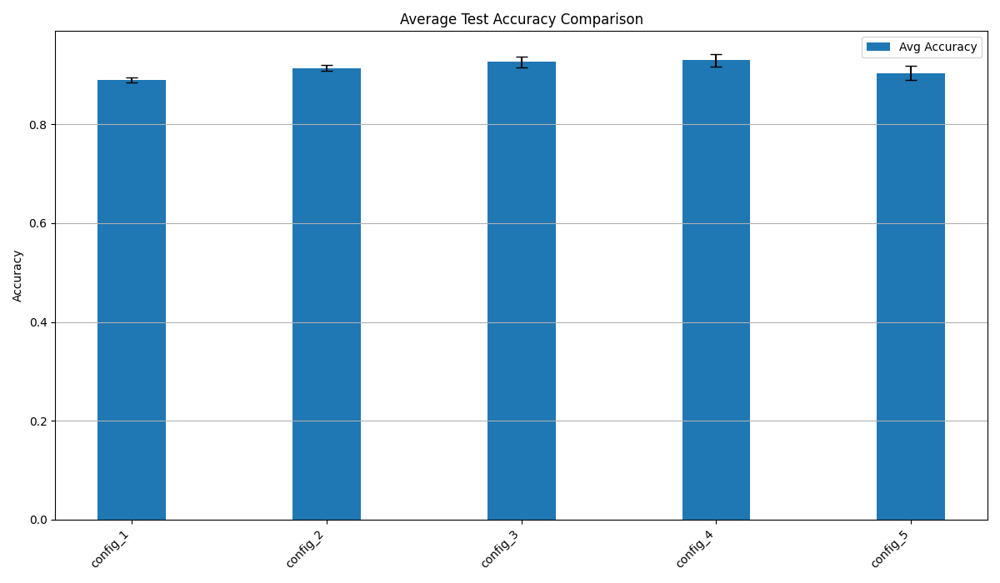
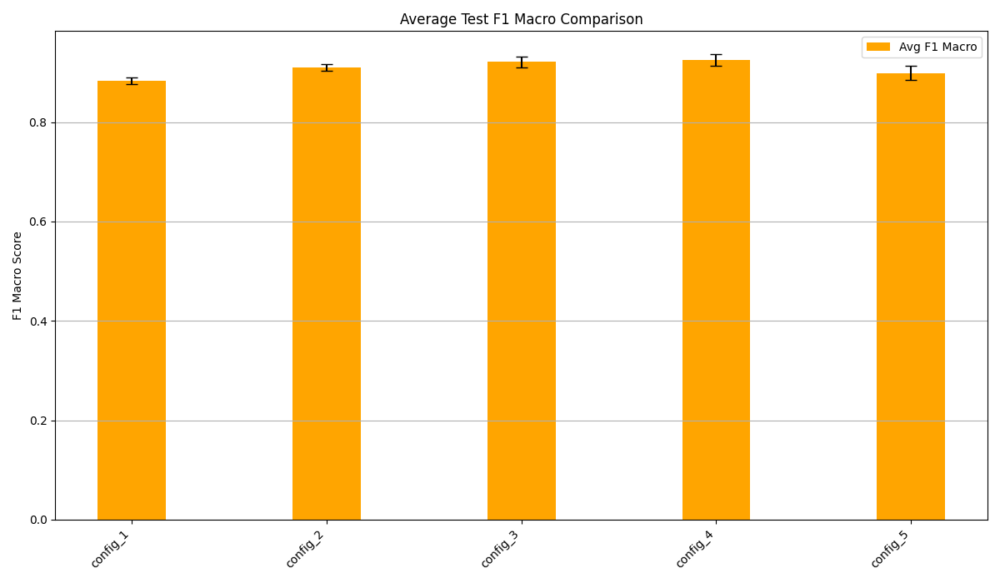
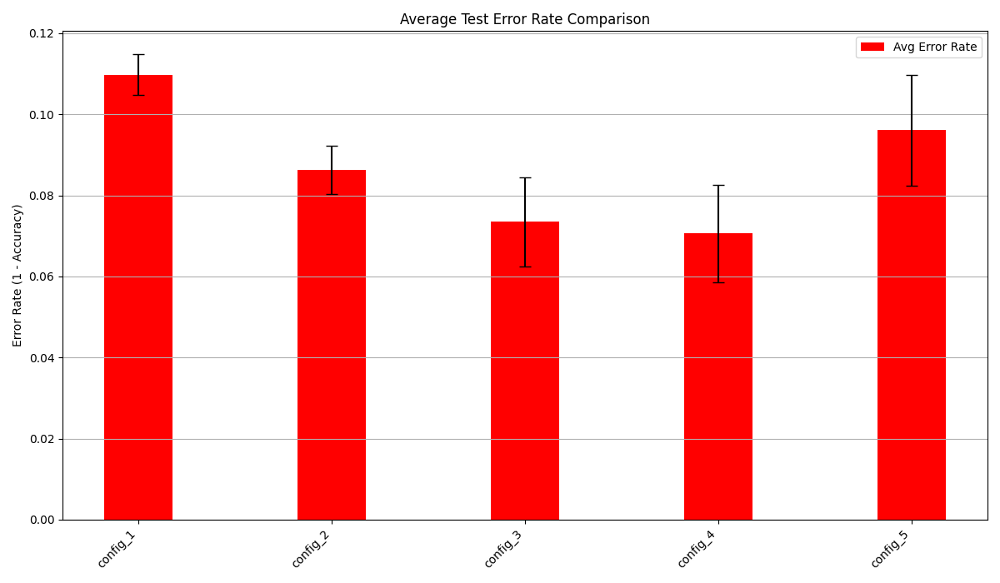

# Báo cáo Kết quả Thử nghiệm Siêu tham số - Phân loại Tin tức Tiếng Việt

## Mục tiêu

Mục tiêu của thử nghiệm này là tìm ra cấu hình siêu tham số tối ưu cho mô hình LSTM hai chiều kết hợp Attention trong bài toán phân loại chủ đề bài báo tiếng Việt. Chúng tôi đã thử nghiệm 5 cấu hình khác nhau, thay đổi các tham số như kích thước lớp ẩn, kích thước embedding, số lớp LSTM, dropout, learning rate, optimizer và batch size.

## Phương pháp thử nghiệm

-   **Mô hình:** LSTM hai chiều + Attention (định nghĩa trong `models/lstm_attention.py`).
-   **Dữ liệu:** Sử dụng bộ dữ liệu đã được tiền xử lý (tạo bởi `preprocess_data.py`) nằm trong thư mục `processed_data/`.
-   **Số Epochs:** Mỗi lần chạy được huấn luyện trong `10` epochs (định nghĩa trong `main.py`). Mô hình tốt nhất được lưu dựa trên validation loss thấp nhất trong quá trình huấn luyện.
-   **Số lần chạy:** Mỗi cấu hình được chạy `3` lần với các seed khác nhau (42, 43, 44) để đảm bảo tính ổn định và đánh giá độ biến động của kết quả.
-   **Các cấu hình thử nghiệm:** 5 cấu hình sau đã được thử nghiệm (định nghĩa trong `main.py`):

    1.  **config_1 (Baseline):**
        -   hidden_dim: 128, attention_dim: 64, embedding_dim: 300, num_layers: 2
        -   batch_size: 32, dropout: 0.5, learning_rate: 0.001, optimizer: adam
    2.  **config_2 (Larger model):**
        -   hidden_dim: 256, attention_dim: 128, embedding_dim: 512, num_layers: 3
        -   batch_size: 32, dropout: 0.4, learning_rate: 0.001, optimizer: adamw
    3.  **config_3 (Different LR and optimizer):**
        -   hidden_dim: 128, attention_dim: 64, embedding_dim: 300, num_layers: 2
        -   batch_size: 16, dropout: 0.3, learning_rate: 0.003, optimizer: rmsprop
    4.  **config_4 (Small batches, high LR):**
        -   hidden_dim: 128, attention_dim: 64, embedding_dim: 300, num_layers: 2
        -   batch_size: 8, dropout: 0.3, learning_rate: 0.01, optimizer: adam
    5.  **config_5 (Larger embeddings, nadam):**
        -   hidden_dim: 128, attention_dim: 128, embedding_dim: 512, num_layers: 2
        -   batch_size: 32, dropout: 0.2, learning_rate: 0.001, optimizer: nadam

-   **Đo lường:** Đánh giá dựa trên Accuracy và F1-Macro trung bình trên tập test sau 3 lần chạy. Sai số (1 - Accuracy) cũng được tính toán.
-   **Theo dõi:** Sử dụng Weights & Biases để log chi tiết quá trình huấn luyện và kết quả của từng lần chạy.

## Kết quả tổng hợp

Bảng dưới đây tóm tắt kết quả trung bình và độ lệch chuẩn của các chỉ số đánh giá trên tập test cho từng cấu hình sau 3 lần chạy.

| config_name | description                           | avg_test_loss | std_test_loss | avg_test_accuracy | std_test_accuracy | avg_test_error | std_test_error | avg_test_f1 | std_test_f1 |
| ----------- | ------------------------------------- | ------------- | ------------- | ----------------- | ----------------- | -------------- | -------------- | ----------- | ----------- |
| config_1    | Baseline                              | 0.3609        | 0.0332        | 0.8902            | 0.0050            | 0.1098         | 0.0050         | 0.8830      | 0.0069      |
| config_2    | Larger model                          | 0.3482        | 0.0138        | 0.9137            | 0.0060            | 0.0863         | 0.0060         | 0.9093      | 0.0070      |
| config_3    | Different learning rate and optimizer | 0.2650        | 0.0655        | 0.9265            | 0.0110            | 0.0735         | 0.0110         | 0.9212      | 0.0109      |
| config_4    | Small batches with high learning rate | 0.3022        | 0.0358        | 0.9294            | 0.0120            | 0.0706         | 0.0120         | 0.9249      | 0.0113      |
| config_5    | Larger embeddings, nadam              | 0.3533        | 0.0216        | 0.9039            | 0.0137            | 0.0961         | 0.0137         | 0.8988      | 0.0140      |

## Biểu đồ so sánh

Các biểu đồ dưới đây trực quan hóa sự khác biệt về hiệu suất trung bình giữa các cấu hình.

**1. So sánh Độ chính xác (Accuracy) trung bình:**

**2. So sánh Điểm F1-Macro trung bình:**

**3. So sánh Tỷ lệ lỗi (Error Rate) trung bình:**

## Phân tích kết quả

-   **Cấu hình tốt nhất:** Dựa trên cả Accuracy (~0.929) và F1-Score (~0.925) trung bình, `config_4` (Small batches, high LR) cho kết quả tốt nhất. Theo sát là `config_3` (Different LR and optimizer) với Accuracy ~0.926 và F1 ~0.921. Mặc dù `config_4` có learning rate cao (0.01) và batch size nhỏ (8), nó vẫn đạt hiệu suất cao nhất trong thử nghiệm này. Tuy nhiên, cần lưu ý rằng độ lệch chuẩn của `config_4` (std_accuracy ~0.012) và `config_3` (std_accuracy ~0.011) cao hơn một chút so với `config_2` (std_accuracy ~0.006), cho thấy kết quả của chúng có thể kém ổn định hơn qua các lần chạy khác nhau.
-   **Ảnh hưởng của kích thước mô hình:** `config_2` (Larger model) với nhiều lớp hơn, hidden dim và embedding dim lớn hơn đã cải thiện đáng kể so với `config_1` (Baseline) (Accuracy ~0.914 vs ~0.890). Điều này cho thấy việc tăng độ phức tạp của mô hình mang lại lợi ích cho bộ dữ liệu này. `config_2` cũng cho thấy độ ổn định cao nhất (độ lệch chuẩn thấp nhất).
-   **Ảnh hưởng của Optimizer và Learning Rate:**
    -   `config_3` (RMSprop, LR=0.003, BS=16) và `config_4` (Adam, LR=0.01, BS=8) đều đạt kết quả rất tốt, vượt qua cả `config_2` (AdamW, LR=0.001, BS=32). Điều này cho thấy việc điều chỉnh learning rate và batch size có thể quan trọng hơn việc chọn optimizer (ít nhất là giữa Adam, AdamW, RMSprop).
    -   `config_4` với learning rate rất cao (0.01) và batch size nhỏ (8) đạt hiệu suất cao nhất, điều này hơi bất ngờ và có thể do đặc thù của bộ dữ liệu hoặc do CosineAnnealingLR giúp kiểm soát learning rate hiệu quả. Tuy nhiên, việc sử dụng LR cao và BS nhỏ thường tiềm ẩn rủi ro về độ ổn định.
    -   `config_5` (NAdam, LR=0.001, BS=32) có hiệu suất khá (Accuracy ~0.904), tốt hơn baseline `config_1` nhưng kém hơn `config_2`, `config_3`, `config_4`. Trong thử nghiệm này, NAdam không nổi trội hơn Adam/AdamW/RMSprop.
-   **Ảnh hưởng của Dropout:** `config_1` (Dropout=0.5) có hiệu suất thấp nhất. `config_5` (Dropout=0.2) hoạt động tốt hơn `config_1` nhưng kém hơn `config_2` (0.4), `config_3` (0.3), `config_4` (0.3). Điều này cho thấy mức dropout trong khoảng 0.3-0.4 có thể phù hợp hơn cho mô hình này.
-   **Độ ổn định:** `config_2` là cấu hình ổn định nhất (std thấp nhất). `config_3` và `config_4` mặc dù có hiệu suất trung bình cao nhất nhưng độ lệch chuẩn cũng cao hơn, cần cân nhắc yếu tố này.

## Kết luận

Dựa trên thử nghiệm với 10 epochs, **`config_4`** (hidden_dim: 128, attention_dim: 64, embedding_dim: 300, num_layers: 2, batch_size: 8, dropout: 0.3, learning_rate: 0.01, optimizer: adam) đạt được **Accuracy (~0.929 ± 0.012)** và **F1-Score (~0.925 ± 0.011)** trung bình cao nhất.

Tuy nhiên, **`config_3`** (hidden_dim: 128, attention_dim: 64, embedding_dim: 300, num_layers: 2, batch_size: 16, dropout: 0.3, learning_rate: 0.003, optimizer: rmsprop) cũng cho kết quả rất cạnh tranh (Accuracy ~0.926 ± 0.011, F1 ~0.921 ± 0.011) và có thể ổn định hơn một chút do learning rate thấp hơn.

**`config_2`** (Larger model) tuy có hiệu suất thấp hơn một chút (Accuracy ~0.914 ± 0.006, F1 ~0.909 ± 0.007) nhưng lại là cấu hình **ổn định nhất** (độ lệch chuẩn thấp nhất).

Lựa chọn cuối cùng giữa `config_4`, `config_3`, và `config_2` có thể phụ thuộc vào ưu tiên giữa hiệu suất đỉnh cao và độ ổn định.

**Hướng phát triển tiếp theo:**

-   Huấn luyện các cấu hình tiềm năng (`config_3`, `config_4`, `config_2`) với số epochs lớn hơn để xem liệu hiệu suất có tiếp tục cải thiện và ổn định hay không.
-   Tinh chỉnh thêm các siêu tham số xung quanh cấu hình tốt nhất (`config_X`).
-   Thử nghiệm với các kỹ thuật regularization khác (ví dụ: Weight Decay).
-   Sử dụng các mô hình Embedding được huấn luyện trước (ví dụ: PhoBERT) thay cho lớp Embedding tự huấn luyện.
-   Phân tích lỗi chi tiết trên các dự đoán sai của mô hình tốt nhất.

## Weights & Biases Logs

Toàn bộ quá trình thử nghiệm, bao gồm các chỉ số huấn luyện chi tiết, cấu hình và kết quả của từng lần chạy, có thể được xem và tương tác trên Weights & Biases tại dashboard của dự án:

[https://wandb.ai/dohoangvunt2005/vietnamese-news-classification](https://wandb.ai/dohoangvunt2005/vietnamese-news-classification)
