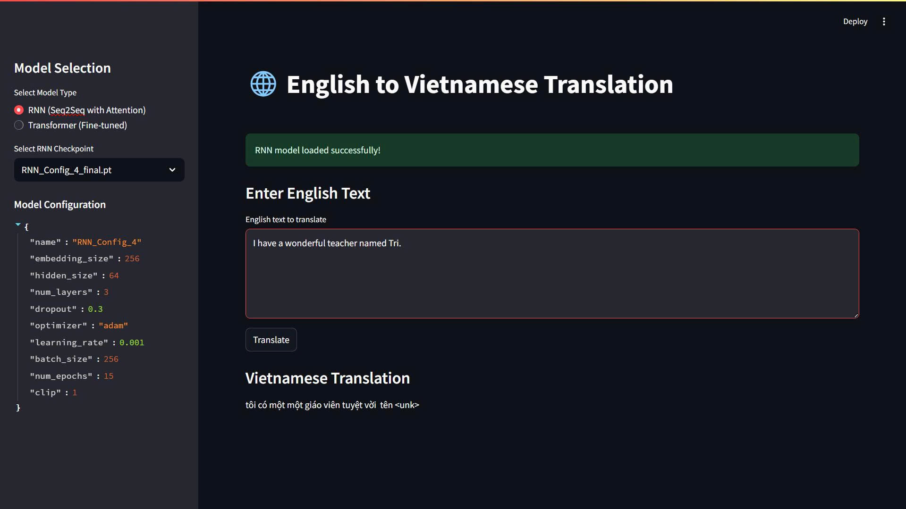

# Bài Tập Week 6: Hệ Thống Dịch Máy Anh-Việt

**Sinh viên thực hiện:** Nguyễn Vũ Xuân  
**Lớp:** AI Intern

Bài tập week 6 này xây dựng hệ thống dịch máy Anh-Việt sử dụng hai kiến trúc mô hình khác nhau: RNN Sequence-to-Sequence với Attention và Transformer. Hệ thống được triển khai dưới dạng ứng dụng web với Streamlit, cho phép người dùng dễ dàng dịch văn bản từ tiếng Anh sang tiếng Việt.

## Tổng Quan

Hệ thống dịch máy này hỗ trợ hai loại mô hình:

1. **RNN (Seq2Seq với Attention)**: Mô hình encoder-decoder sử dụng GRU cells với cơ chế attention, được huấn luyện từ đầu trên dữ liệu song ngữ Anh-Việt.

2. **Transformer**: Mô hình dựa trên kiến trúc Transformer, được fine-tune từ các mô hình pretrained của HuggingFace trên dữ liệu song ngữ Anh-Việt.

## Cấu Trúc Bài Tập

```
.
├── app.py                  # Ứng dụng Streamlit chính
├── config.py               # Cấu hình cho các mô hình và quá trình huấn luyện
├── rnn_model.py            # Mã nguồn cho mô hình RNN Seq2Seq
├── transformer_model.py    # Mã nguồn cho fine-tuning mô hình Transformer
├── preprocess.py           # Tiền xử lý dữ liệu đầy đủ
├── requirements.txt        # Các thư viện phụ thuộc
├── data/                   # Thư mục chứa dữ liệu
│   ├── raw/                # Dữ liệu gốc
│   └── processed/          # Dữ liệu đã xử lý
├── checkpoints/            # Checkpoint của các mô hình RNN
├── models/                 # Checkpoint của các mô hình Transformer fine-tuned
└── results/                # Kết quả đánh giá và log
```

## Yêu Cầu Hệ Thống

- Python 3.9+
- CUDA (khuyến nghị cho huấn luyện và inference nhanh)

## Cài Đặt

1. Tạo môi trường conda mới:
```bash
conda create -n translation python=3.9
conda activate translation
```

2. Cài đặt các thư viện phụ thuộc:
```bash
pip install -r requirements.txt
```

## Hướng Dẫn Thực Hiện Bài Tập

### Tiền Xử Lý Dữ Liệu

Dữ liệu cần được tiền xử lý trước khi huấn luyện mô hình RNN:

```bash
python preprocess.py  # Xử lý toàn bộ dữ liệu
```
### Huấn Luyện Mô Hình RNN

```bash
python rnn_model.py --config RNN_Config_1
```

Bạn có thể thay đổi cấu hình bằng cách chọn một trong các cấu hình có sẵn trong `config.py` (RNN_Config_1, RNN_Config_2, ...).

### Fine-tune Mô Hình Transformer

```bash
python transformer_model.py --config Transformer_Config_1
```

Tương tự, bạn có thể chọn các cấu hình Transformer khác nhau từ `config.py`.

### Chạy Ứng Dụng Dịch

```bash
streamlit run app.py
```

Ứng dụng sẽ chạy trên trình duyệt web và cho phép bạn:
- Chọn giữa mô hình RNN và Transformer
- Chọn checkpoint cụ thể để sử dụng
- Nhập văn bản tiếng Anh và dịch sang tiếng Việt

#### Giao diện ứng dụng Streamlit



Hình ảnh trên hiển thị giao diện ứng dụng Streamlit với khu vực nhập văn bản tiếng Anh, kết quả dịch tiếng Việt, và thanh bên cho phép lựa chọn mô hình và checkpoint.

## Cấu Hình Mô Hình

### RNN Model

Các cấu hình RNN được định nghĩa trong `config.py` với các tham số như:
- Kích thước embedding
- Kích thước hidden state
- Số lớp GRU
- Tỷ lệ dropout
- Optimizer và learning rate

### Transformer Model

Các cấu hình Transformer sử dụng các mô hình pretrained từ HuggingFace với các tham số fine-tuning như:
- Mô hình pretrained (ví dụ: Helsinki-NLP/opus-mt-en-vi)
- Batch size
- Learning rate
- Số epochs
- Gradient accumulation steps

## Kết Quả

Kết quả đánh giá các mô hình được lưu trong thư mục `results/`, bao gồm:
- Loss trên tập train và validation
- Điểm BLEU
- Thời gian huấn luyện

## Tính Năng

- **Dịch văn bản**: Dịch văn bản từ tiếng Anh sang tiếng Việt
- **Chọn mô hình**: Lựa chọn giữa RNN và Transformer
- **Hiển thị thông tin mô hình**: Xem cấu hình và metrics của mô hình đã chọn
- **Xử lý lỗi**: Thông báo lỗi rõ ràng và gợi ý khắc phục

## Ghi Chú

- Mô hình RNN được huấn luyện từ đầu trên dữ liệu song ngữ Anh-Việt
- Mô hình Transformer được fine-tune từ các mô hình pretrained của HuggingFace
- Checkpoint của các mô hình được lưu trong thư mục `checkpoints/` (RNN) và `models/` (Transformer)
- Dữ liệu đã xử lý được lưu trong thư mục `data/processed/`
