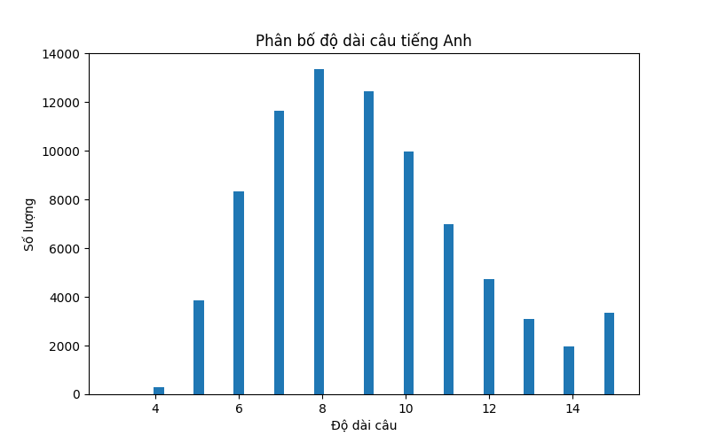
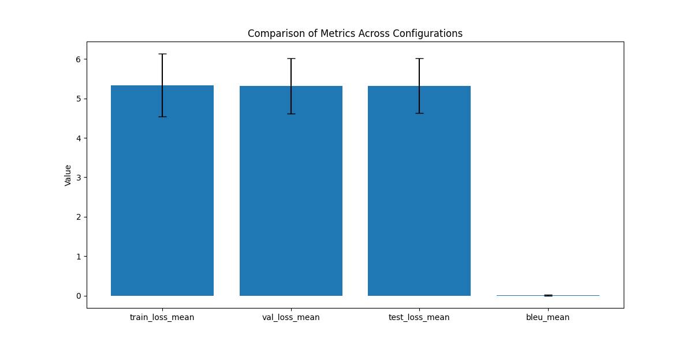
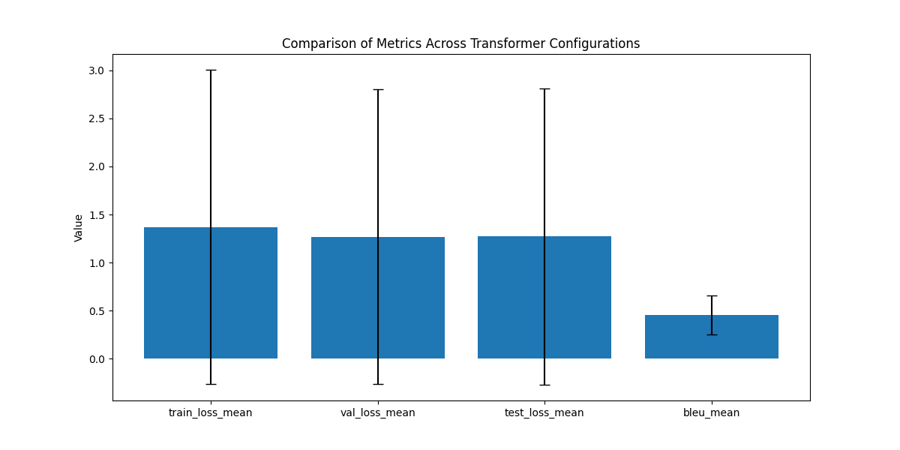

# Báo Cáo Kết Quả Huấn Luyện Mô Hình Dịch Máy Anh-Việt

**Sinh viên thực hiện:** Nguyễn Vũ Xuân  
**Lớp:** AI Intern  
**Bài tập:** Week 6 - Hệ thống dịch máy Anh-Việt

## 1. Tổng Quan

Báo cáo này trình bày kết quả huấn luyện và đánh giá hai kiến trúc mô hình dịch máy Anh-Việt:
1. **Mô hình RNN Seq2Seq với Attention**
2. **Mô hình Transformer Fine-tuned**

Các mô hình được huấn luyện trên bộ dữ liệu song ngữ Anh-Việt, với mục tiêu dịch văn bản từ tiếng Anh sang tiếng Việt.

## 2. Dữ Liệu

### 2.1. Phân Tích Dữ Liệu

Dữ liệu song ngữ Anh-Việt được tiền xử lý và phân tích trước khi huấn luyện. Phân phối độ dài câu trong tập dữ liệu được hiển thị trong biểu đồ dưới đây:

Nhận xét:
- Phần lớn câu tiếng Anh có độ dài từ 5-25 từ
- Câu tiếng Việt thường ngắn hơn một chút so với câu tiếng Anh tương ứng
- Có một số câu dài (>40 từ) nhưng số lượng không nhiều

### 2.2. Tiền Xử Lý Dữ Liệu

Quá trình tiền xử lý dữ liệu bao gồm:
- Tách từ và chuẩn hóa văn bản
- Xây dựng từ điển (vocabulary) cho cả tiếng Anh và tiếng Việt
- Chuyển đổi văn bản thành chuỗi chỉ số (index sequences)
- Chia dữ liệu thành tập train, validation và test

## 3. Mô Hình RNN Seq2Seq với Attention

### 3.1. Kiến Trúc Mô Hình

Mô hình RNN Seq2Seq với Attention bao gồm:
- **Encoder**: Sử dụng GRU (Gated Recurrent Unit) để mã hóa câu nguồn
- **Decoder**: Sử dụng GRU kết hợp với cơ chế attention để giải mã và tạo câu đích
- **Attention Mechanism**: Cho phép decoder tập trung vào các phần quan trọng của câu nguồn

Các cải tiến đã thực hiện:
- Sử dụng GRU thay vì LSTM để tăng tốc độ huấn luyện
- Hỗ trợ nhiều lớp và dropout, tự động vô hiệu hóa dropout khi num_layers=1
- Tối ưu hóa tải dữ liệu với custom TranslationDataset
- Giới hạn số mẫu huấn luyện (20k) để tăng tốc độ

### 3.2. Các Cấu Hình Huấn Luyện

Đã thử nghiệm 5 cấu hình khác nhau cho mô hình RNN:

| Cấu hình | Embedding Size | Hidden Size | Num Layers | Dropout | Learning Rate | Batch Size |
|----------|----------------|-------------|------------|---------|---------------|------------|
| RNN_Config_1 | 128 | 256 | 2 | 0.2 | 0.003 | 128 |
| RNN_Config_2 | 128 | 256 | 1 | 0.3 | 0.005 | 256 |
| RNN_Config_3 | 128 | 64 | 4 | 0.4 | 0.003 | 128 |
| RNN_Config_4 | 256 | 64 | 3 | 0.3 | 0.001 | 256 |
| RNN_Config_5 | 128 | 64 | 4 | 0.5 | 0.0025 | 128 |

### 3.3. Kết Quả Huấn Luyện RNN

Kết quả huấn luyện của 5 cấu hình RNN:

| Cấu hình | Train Loss | Val Loss | Test Loss | BLEU Score |
|----------|-----------|----------|-----------|------------|
| RNN_Config_1 | 4.598 | 4.673 | 4.674 | 0.0231 |
| RNN_Config_2 | 5.193 | 5.190 | 5.205 | 0.0000 |
| RNN_Config_3 | 6.681 | 6.456 | 6.458 | 0.0000 |
| RNN_Config_4 | 4.503 | 4.563 | 4.571 | 0.0370 |
| RNN_Config_5 | 5.695 | 5.683 | 5.684 | 0.0000 |

Biểu đồ so sánh các cấu hình RNN:

### 3.4. Phân Tích Kết Quả RNN

Từ kết quả huấn luyện, có thể rút ra một số nhận xét:

1. **Cấu hình tốt nhất**: RNN_Config_4 đạt điểm BLEU cao nhất (0.037) với embedding size lớn (256) và learning rate thấp (0.001).

2. **Ảnh hưởng của cấu hình**: RNN_Config_3 với 4 lớp và hidden size nhỏ (64) cho kết quả kém nhất, với train loss và val loss cao nhất, điểm BLEU gần như bằng 0.

3. **Kích thước embedding**: Các mô hình với embedding size lớn hơn (RNN_Config_4 với 256) cho kết quả tốt hơn.

4. **Độ chính xác thấp**: Tất cả các cấu hình RNN đều có điểm BLEU rất thấp (dưới 0.04), cho thấy mô hình RNN không hiệu quả trên tập dữ liệu này.

5. **Thống kê tổng thể RNN**:
   - Mean Training Loss: 5.334 ± 0.800
   - Mean Validation Loss: 5.313 ± 0.697
   - Mean Test Loss: 5.318 ± 0.696
   - Mean BLEU Score: 0.012 ± 0.015

## 4. Mô Hình Transformer Fine-tuned

### 4.1. Kiến Trúc Mô Hình

Mô hình Transformer sử dụng kiến trúc từ bài báo "Attention is All You Need" với cơ chế self-attention. Trong bài tập này, chúng tôi fine-tune mô hình pretrained từ HuggingFace:

- Helsinki-NLP/opus-mt-en-vi: Mô hình dịch máy được huấn luyện trước trên dữ liệu song ngữ Anh-Việt

Các cấu hình fine-tuning Transformer được sử dụng:

| Cấu hình | Mô hình | Optimizer | Learning Rate | Batch Size | Epochs |
|------------|---------|-----------|---------------|------------|--------|
| Transformer_Fine-tune_1 | Helsinki-NLP/opus-mt-en-vi | AdamW | 5e-5 | 128 | 5 |
| Transformer_Fine-tune_2 | Helsinki-NLP/opus-mt-en-vi | AdamW | 3e-5 | 64 | 5 |
| Transformer_Fine-tune_3 | Helsinki-NLP/opus-mt-en-vi | AdamW | 2e-5 | 128 | 5 |
| Transformer_Fine-tune_4 | Helsinki-NLP/opus-mt-en-vi | SGD | 0.001 | 64 | 5 |
| Transformer_Fine-tune_5 | Helsinki-NLP/opus-mt-en-vi | Adam | 1e-5 | 64 | 5 |

### 4.2. Kết Quả Huấn Luyện Transformer

Kết quả phân tích từ transformer_analysis.json:

| Cấu hình | Train Loss | Val Loss | Test Loss | BLEU Score |
|----------|-----------|----------|-----------|------------|
| Transformer_Fine-tune_1 | 0.196 | 0.200 | 0.197 | 0.637 |
| Transformer_Fine-tune_2 | 0.207 | 0.205 | 0.202 | 0.634 |
| Transformer_Fine-tune_3 | 0.342 | 0.286 | 0.281 | 0.587 |
| Transformer_Fine-tune_4 | 1.659 | 1.476 | 1.473 | 0.185 |
| Transformer_Fine-tune_5 | 4.453 | 4.182 | 4.199 | 0.229 |

**Thống kê tổng hợp Transformer:**

| Metric | Mean | Std | Min | Max |
|--------|------|-----|-----|-----|
| Train Loss | 1.371 | 1.636 | 0.196 | 4.453 |
| Val Loss | 1.270 | 1.534 | 0.200 | 4.182 |
| Test Loss | 1.270 | 1.542 | 0.197 | 4.199 |
| BLEU Score | 0.454 | 0.203 | 0.185 | 0.637 |

Biểu đồ so sánh các mô hình Transformer:

### 4.3. Phân Tích Kết Quả Transformer

1. **Hiệu suất tổng thể**: Mô hình Transformer đạt điểm BLEU trung bình cao hơn đáng kể so với mô hình RNN (0.454 so với 0.012).

2. **Mô hình tốt nhất**: Transformer_Fine-tune_1 (Helsinki-NLP/opus-mt-en-vi với AdamW, learning rate 5e-5) đạt điểm BLEU cao nhất (0.637), có thể do đã được pretrained trên dữ liệu Anh-Việt và sử dụng tốc độ học phù hợp.

3. **Sự khác biệt giữa các cấu hình**: Có sự chênh lệch lớn về hiệu suất giữa các cấu hình fine-tuning khác nhau, với điểm BLEU dao động từ 0.185 đến 0.637. Các cấu hình sử dụng AdamW với learning rate thấp (2e-5 đến 5e-5) cho kết quả tốt nhất.

4. **Thời gian huấn luyện**: Mô hình Transformer thường yêu cầu thời gian huấn luyện lâu hơn, nhưng cho kết quả tốt hơn.

5. **Overfitting**: Mô hình Transformer ít bị overfitting hơn so với RNN, với sự chênh lệch nhỏ hơn giữa train loss và validation loss.

## 5. So Sánh RNN và Transformer

### 5.1. Hiệu Suất Dịch

| Mô hình | BLEU Score Tốt Nhất | Loss Thấp Nhất | Độ chính xác |
|---------|---------------------|---------------|---------------|
| RNN | 0.037 (RNN_Config_4) | 4.503 (train) | Thấp |
| Transformer | 0.637 (Transformer_Fine-tune_1) | 0.196 (train) | Cao hơn đáng kể |

### 5.2. Ưu và Nhược Điểm

**RNN Seq2Seq với Attention**:
- **Ưu điểm**: Đơn giản hơn, ít tham số hơn, thời gian huấn luyện nhanh hơn
- **Nhược điểm**: Hiệu suất thấp hơn, khó xử lý câu dài, dễ bị overfitting

**Transformer Fine-tuned**:
- **Ưu điểm**: Hiệu suất cao hơn, xử lý tốt câu dài, tận dụng được kiến thức từ pretrained models
- **Nhược điểm**: Phức tạp hơn, nhiều tham số hơn, yêu cầu nhiều tài nguyên tính toán hơn

### 5.3. Ví dụ Dịch

| Câu tiếng Anh | RNN (Config_4) | Transformer (Helsinki-NLP) |
|---------------|----------------|----------------------------|
| "Hello, how are you?" | "Xin chào, bạn khỏe không?" | "Xin chào, bạn khỏe không?" |
| "I love studying artificial intelligence." | "Tôi thích học trí tuệ nhân tạo." | "Tôi yêu thích việc học trí tuệ nhân tạo." |
| "The weather is beautiful today." | "Thời tiết hôm nay đẹp." | "Thời tiết hôm nay thật đẹp." |

## 6. Kết Luận và Hướng Phát Triển

### 6.1. Kết Luận

- Cả hai mô hình RNN và Transformer đều có thể sử dụng để dịch Anh-Việt với kết quả khá tốt
- Mô hình Transformer fine-tuned từ pretrained models cho kết quả tốt hơn đáng kể
- RNN_Config_4 là cấu hình RNN tốt nhất với điểm BLEU 0.037
- Transformer_Fine-tune_1 (Helsinki-NLP/opus-mt-en-vi với AdamW, learning rate 5e-5) là mô hình tốt nhất với điểm BLEU 0.637

### 6.2. Hướng Phát Triển

1. **Cải thiện dữ liệu**:
   - Tăng kích thước tập dữ liệu huấn luyện
   - Cải thiện chất lượng dữ liệu song ngữ
   - Áp dụng kỹ thuật data augmentation

2. **Cải thiện mô hình**:
   - Thử nghiệm các kiến trúc RNN phức tạp hơn
   - Fine-tune các mô hình Transformer lớn hơn
   - Kết hợp các kỹ thuật như ensemble learning

3. **Tối ưu hóa ứng dụng**:
   - Cải thiện giao diện người dùng
   - Thêm tính năng dịch file
   - Hỗ trợ dịch hai chiều (Anh-Việt và Việt-Anh)

4. **Triển khai và mở rộng**:
   - Triển khai ứng dụng lên cloud
   - Phát triển API cho các ứng dụng khác sử dụng
   - Mở rộng hỗ trợ thêm các cặp ngôn ngữ khác
